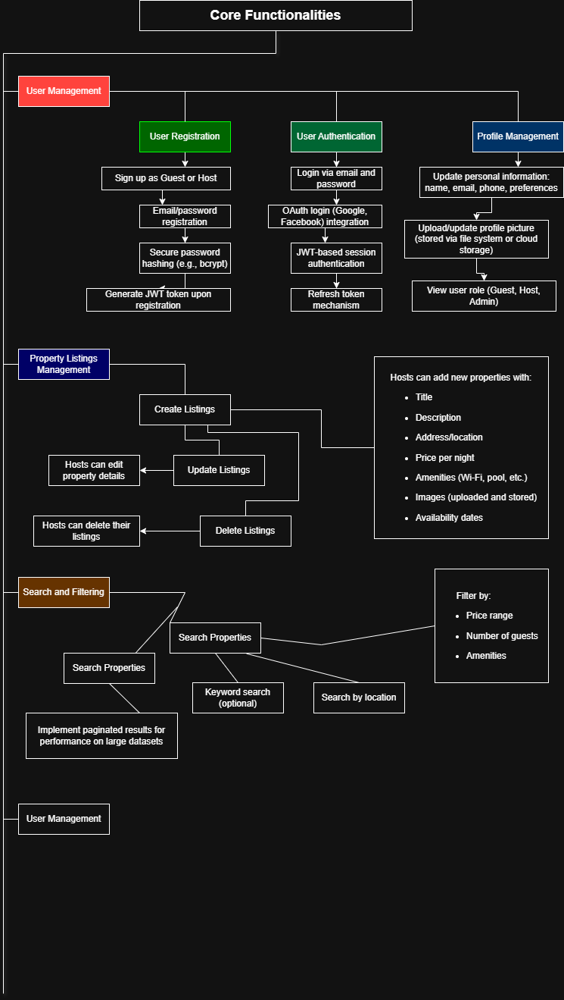

# Airbnb Clone Backend: Detailed Features and Functionalities Document

## 🎯 Project Objective
To build a scalable, secure, and robust backend system that powers an Airbnb-like rental marketplace, enabling users to register, list properties, search/book listings, manage bookings/payments, and receive notifications.

---

## 📁 1. Core Functionalities

### 1.1 User Management

- **User Registration**
  - Sign up as Guest or Host
  - Email/password registration
  - Secure password hashing (e.g., bcrypt)
  - Generate JWT token upon registration

- **User Authentication**
  - Login via email and password
  - OAuth login (Google, Facebook) integration
  - JWT-based session authentication
  - Refresh token mechanism

- **Profile Management**
  - Update personal information: name, email, phone, preferences
  - Upload/update profile picture (stored via file system or cloud storage)
  - View user role (Guest, Host, Admin)

---

### 1.2 Property Listings Management

- **Create Listings**
  - Hosts can add new properties with:
    - Title
    - Description
    - Address/location
    - Price per night
    - Amenities (Wi-Fi, pool, etc.)
    - Images (uploaded and stored)
    - Availability dates

- **Update Listings**
  - Hosts can edit property details

- **Delete Listings**
  - Hosts can delete their listings

---

### 1.3 Search and Filtering

- **Search Properties**
  - Search by location
  - Filter by:
    - Price range
    - Number of guests
    - Amenities
  - Keyword search (optional)

- **Pagination**
  - Implement paginated results for performance on large datasets

---

### 1.4 Booking Management

- **Booking Creation**
  - Guests can request to book a property for specified dates
  - Validate booking dates to prevent overlaps
  - Create booking record with status "pending"

- **Booking Approval/Auto-confirmation**
  - Instant booking or host approval flow
  - Update status to "confirmed"

- **Booking Cancellation**
  - Guests and hosts can cancel based on rules
  - Track cancellation reason and timestamp

- **Booking Status Tracking**
  - Statuses: `pending`, `confirmed`, `canceled`, `completed`

---

### 1.5 Payment Integration

- **Payment Processing**
  - Use Stripe/PayPal APIs
  - Charge guests upon booking confirmation
  - Support multiple currencies
  - Secure handling of payment details (PCI compliance)

- **Payout to Hosts**
  - Automatically release payment to host after booking completion
  - Log transaction history

---

### 1.6 Reviews and Ratings

- **Post-Booking Reviews**
  - Guests can leave 1–5 star rating + text review
  - Reviews tied to specific bookings
  - One review per booking

- **Host Responses**
  - Hosts can respond publicly to reviews

- **Moderation (Admin)**
  - Admins can flag or remove inappropriate reviews

---

### 1.7 Notifications System

- **In-App Notifications**
  - Triggered on booking events: confirmation, cancellation, payment

- **Email Notifications**
  - Via SendGrid/Mailgun:
    - Booking confirmations
    - Payment receipts
    - Host payout notices

---

### 1.8 Admin Dashboard

- **User Management**
  - View/edit/delete users
  - Ban/unban users

- **Listings Management**
  - View/edit/remove property listings

- **Booking Oversight**
  - View all bookings
  - Override status if necessary

- **Transaction Monitoring**
  - View payment and payout logs

---

## 🛠️ 2. Technical Requirements

### 2.1 Database Management

- **Relational Database**
  - PostgreSQL / MySQL

- **Schema Design**
  - `Users` table
  - `Properties` table
  - `Bookings` table
  - `Reviews` table
  - `Payments` table
  - `Notifications` table (optional)

---

### 2.2 API Development

- **RESTful API Endpoints**
  - Follow standard HTTP methods (GET, POST, PUT/PATCH, DELETE)
  - Use appropriate status codes
  - Swagger/OpenAPI docs for testing

- **GraphQL (Optional)**
  - For complex queries involving nested resources

---

### 2.3 Authentication and Authorization

- **JWT Authentication**
  - Access and Refresh tokens
  - Middleware to protect private routes

- **Role-Based Access Control (RBAC)**
  - Guest: search/book/list properties
  - Host: create/manage listings and bookings
  - Admin: full system access

---

### 2.4 File Storage

- **Image Handling**
  - Property and profile images stored locally or via AWS S3 / Cloudinary
  - Metadata stored in database

---

### 2.5 Third-Party Services

- **Email Service**
  - SendGrid or Mailgun for notification emails

- **Payment Gateway**
  - Stripe or PayPal for handling secure transactions

---

### 2.6 Error Handling and Logging

- **Global Error Handler**
  - Capture and return structured error responses (e.g., 400, 401, 403, 500)

- **Logging**
  - Log API errors and key actions (e.g., booking creation)
  - Tools: Winston, Morgan, or similar

---

## 🚀 3. Non-Functional Requirements

### 3.1 Scalability

- **Modular Architecture**
  - Split services (User, Property, Booking, etc.)

- **Horizontal Scaling**
  - Enable deployment with load balancers and multiple instances

---

### 3.2 Security

- **Data Encryption**
  - Encrypt passwords, sensitive user data

- **Rate Limiting**
  - Prevent abuse of public endpoints

- **Firewalls & Secure Headers**
  - Use security middleware (e.g., Helmet.js)

---

### 3.3 Performance Optimization

- **Caching**
  - Use Redis to cache search results or session data

- **Database Optimization**
  - Indexing frequently queried fields
  - Query optimization for complex joins

---

### 3.4 Testing

- **Automated Tests**
  - Unit tests (e.g., for each controller/service)
  - Integration tests (e.g., booking + payment)
  - Testing Framework: Pytest / Jest (based on language)

- **API Testing**
  - Postman collections / Swagger UI / CI Integration

---

## 📦 Optional Enhancements

- Chat messaging between host and guest  
- Referral or rewards system  
- Promo codes and discounts  
- Availability calendar for hosts

---

## ✅ Summary Checklist

| Feature                          | Supported |
|----------------------------------|-----------|
| User Registration/Login          | ✅        |
| OAuth Login                      | ✅        |
| Role-Based Access                | ✅        |
| Property Management              | ✅        |
| Search & Filter                  | ✅        |
| Booking System                   | ✅        |
| Payment Integration              | ✅        |
| Review System                    | ✅        |
| Notifications                    | ✅        |
| Admin Dashboard                  | ✅        |
| REST API                         | ✅        |
| Authentication (JWT)             | ✅        |
| Error Handling & Logging         | ✅        |
| Security & Performance           | ✅        |
| Scalability                      | ✅        |
| Testing Frameworks               | ✅        |

